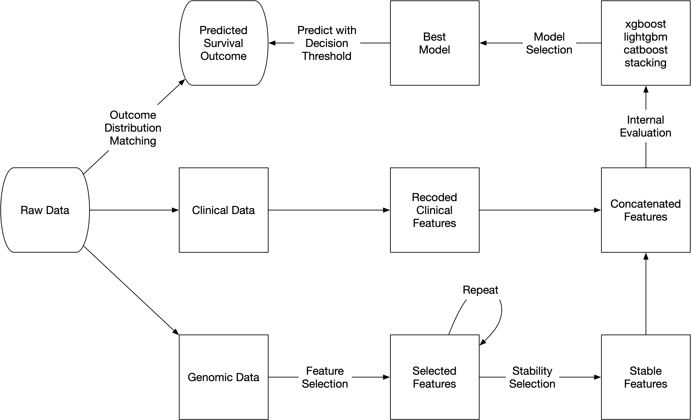

# Brain Cancer Predictive Modeling 

Analysis pipeline for the precisionFDA Brain Cancer Predictive Modeling and Biomarker Discovery [challenge](https://precision.fda.gov/challenges/8) using [msaenet](https://nanx.me/msaenet/).

It is ranked as the [2nd place solution](https://precision.fda.gov/challenges/8/view/results) by predictive performance.

Team: [Nan Xiao](https://nanx.me/), [Soner Koc](https://github.com/skoc), [Kaushik Ghose](https://kaushikghose.wordpress.com/) from [Seven Bridges](https://www.sevenbridges.com/).

## Model

This solution features the following models:

- Feature selection with the multi-step adaptive SCAD-net method ([Xiao and Xu, 2015](https://www.tandfonline.com/doi/full/10.1080/00949655.2015.1016944)).
- A relaxed version of the "Stability Selection" procedure ([Meinshausen and Bühlmann, 2010](https://doi.org/10.1111/j.1467-9868.2010.00740.x)) was used to aggregate the selected features from 100 perturbated models and only keep the consistently selected features.
- Gradient boosting decision tree (GBDT) models for predictive modeling with the selected genomic features and all four clinical features. The tree models include xgboost ([Chen and Guestrin, 2016](https://doi.org/10.1145/2939672.2939785)), lightgbm ([Ke et al., 2017](https://papers.nips.cc/paper/6907-lightgbm-a-highly-efficient-gradient-boosting-decision)), catboost ([Prokhorenkova et al., 2018](https://papers.nips.cc/paper/7898-catboost-unbiased-boosting-with-categorical-features)), and a two-layer stacking tree model ([Wolpert, 1992](https://doi.org/10.1016/S0893-6080(05)80023-1)). We created an R package [stackgbm](https://github.com/nanxstats/stackgbm) for doing this after the challenge ended.

## Pipeline

## Dependencies

Most of the depended R packages are installable from CRAN. Two special ones:

- lightgbm: [install](https://github.com/microsoft/LightGBM/tree/master/R-package) from source. For macOS, it is advised to compile with a Homebrew gcc toolchain instead of the default LLVM toolchain.
- catboost: [install](https://catboost.ai/docs/installation/r-installation-binary-installation.html#r-installation-binary-installation) the latest compiled binary package from their GitHub releases.

## Reproducibility

Open `run.R` and follow the steps. Note that some steps could take a few hours to run despite the fact that they are fully parallelized.
